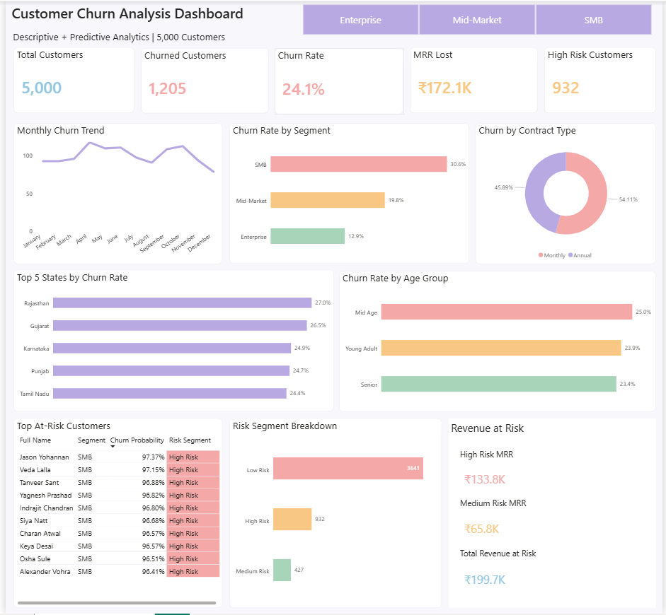

# Customer Churn Prediction & Analysis


## 📌 Project Overview

An end-to-end data analytics project that combines **Descriptive Analytics** and **Predictive Analytics** to identify customers at risk of churning in a subscription-based business with 5,000 customers across SMB, Mid-Market and Enterprise segments.

Built across three stages:
MySQL (Schema + KPI Queries) → Python (Machine Learning) → Power BI (Dashboard)

---

## 🎯 Business Objectives

- Identify which customer segments have the highest churn rate
- Measure revenue lost due to customer churn
- Analyze the impact of contract type and payment method on churn
- Understand regional and demographic churn patterns
- Predict which customers are most likely to churn using Machine Learning
- Surface high-risk customers for proactive retention action

---

## 🗂️ Project Structure

```
customer-churn-prediction/
│
├── 📁 data/
│   ├── customers.csv           # 5,000 customers with demographics
│   ├── products.csv            # 5 subscription plans
│   ├── contracts.csv           # 5,000 customer contracts
│   ├── usage_logs.csv          # 60,000 monthly usage records
│   └── support_tickets.csv     # 8,529 support ticket records
│
├── 📁 sql/
│   └── Customer_Churn_Prediction_and_Analysis.sql  # Schema + 13 KPI queries
│
├── 📁 ml/
│   └── Customer_Churn_Prediction_and_Analysis.py   # Random Forest model
│
├── 📁 dashboard/
│   ├── Customer_Churn_Prediction_and_Analysis_Dashboard.pbix
│   └── Customer_Churn_Prediction_and_Analysis_Dashboard_Screenshot.png
│
└── README.md
```

---

## 🛠️ Tools & Technologies

| Tool | Purpose |
|---|---|
| MySQL Workbench | Database design, data storage, KPI queries |
| Python | Machine Learning — Random Forest Classifier |
| scikit-learn | Model training and evaluation |
| pandas | Data manipulation |
| mysql-connector-python | Direct MySQL to Python connection |
| Power BI Desktop | Data modeling, DAX measures, dashboard |
| GitHub | Version control and project hosting |

---

## 🏗️ Data Architecture

| Table | Rows | Primary Key | Relationship |
|---|---|---|---|
| customers | 5,000 | customer_id | Parent table — center of schema |
| products | 5 | product_id | Parent table |
| contracts | 5,000 | contract_id | FK → customers, FK → products |
| usage_logs | 60,000 | usage_id | FK → customers (12 rows per customer) |
| support_tickets | 8,529 | ticket_id | FK → customers |
| predictions | 5,000 | customer_id | FK → customers (ML model output) |

**Relationships:**
- `customers` (1) → (*) `contracts`
- `products` (1) → (*) `contracts`
- `customers` (1) → (*) `usage_logs`
- `customers` (1) → (*) `support_tickets`
- `customers` (1) → (1) `predictions`

---

## 🗄️ Stage 1 — MySQL

**File:** `sql/Customer_Churn_Prediction_and_Analysis.sql`

### Schema Design
Created 5 normalized tables with foreign key relationships:
- `customers` — customer demographics and account info
- `products` — subscription plans offered
- `contracts` — core churn fact table (one row per customer)
- `usage_logs` — monthly product usage per customer (12 months)
- `support_tickets` — individual support ticket records

### KPI Queries (13 total)

| # | Business Question |
|---|---|
| KPI 1 | Overall churn rate |
| KPI 2 | Churn rate by customer segment |
| KPI 3 | Churn rate by contract type |
| KPI 4 | Monthly Recurring Revenue (MRR) lost to churn |
| KPI 5 | Churn rate by state |
| KPI 6 | Churn rate by product/plan |
| KPI 7 | Impact of auto-renewal on churn |
| KPI 8 | Average tenure of churned vs active customers |
| KPI 9 | Churn trend by month |
| KPI 10 | Average usage stats — churned vs active |
| KPI 11 | Top 10 high-value customers who churned |
| KPI 12 | Support ticket severity for churned vs active |
| KPI 13 | Payment method vs churn |

### Advanced SQL Concepts Used
- CASE WHEN segmentation
- DATEDIFF for tenure calculation
- DATE_FORMAT for monthly trend
- COALESCE for NULL handling
- Multi-table JOINs across 5 tables
- Aggregate functions with GROUP BY
- CREATE OR REPLACE VIEW for master churn view

---

## 🤖 Stage 2 — Python (Machine Learning)

**File:** `ml/Customer_Churn_Prediction_and_Analysis.py`

### What Was Done
- Connected directly to MySQL using `mysql-connector-python`
- Fetched data using a SQL query joining all tables
- Feature engineering — converted text columns to numbers using LabelEncoder
- Trained a Random Forest Classifier on 11 features
- Evaluated model on 20% test data
- Generated churn predictions for all 5,000 customers
- Wrote predictions back to MySQL as a new `predictions` table

### Model Performance

| Metric | Score |
|---|---|
| Accuracy | 93.20% |
| AUC Score | 0.9715 |
| Training rows | 4,000 (80%) |
| Testing rows | 1,000 (20%) |

### Top Features Driving Churn

| Feature | Importance |
|---|---|
| Average Monthly Logins | 49.7% |
| Average Feature Usage Score | 40.1% |
| Tenure Months | 3.1% |
| Contract Type | 1.8% |
| Segment | 1.5% |

### Risk Segments Generated

| Segment | Customers | Avg Churn Probability |
|---|---|---|
| High Risk | 932 | 81.5% |
| Medium Risk | 427 | 44.1% |
| Low Risk | 3,641 | 6.7% |

---

## 📊 Stage 3 — Power BI Dashboard

**File:** `dashboard/Customer_Churn_Prediction_and_Analysis_Dashboard.pbix`

### Data Model
Star schema with 6 tables connected via customer_id and product_id relationships in Power BI.

### DAX Measures (12 total)
- Total Customers, Total Churned, Active Customers
- Churn Rate %
- MRR Lost, MRR Retained
- High Risk Count, Medium Risk Count, Low Risk Count
- High Risk MRR, Medium Risk MRR
- Total Revenue at Risk

### Dashboard — Single Page

**Descriptive Analytics (historical churn patterns)**
- Monthly Churn Trend — Line chart
- Churn Rate by Segment — Bar chart
- Churn by Contract Type — Donut chart
- Top 5 States by Churn Rate — Bar chart
- Churn Rate by Age Group — Bar chart

**Predictive Analytics (ML model output)**
- Top At-Risk Customers — Table sorted by churn probability
- Risk Segment Breakdown — Bar chart
- Revenue at Risk — KPI cards

**Interactive Features**
- Segment slicer — filter entire dashboard by SMB, Mid-Market, Enterprise
- Star schema data model with 6 tables and proper relationships



---

## 📈 Key Business Insights

### Churn Overview
- Overall churn rate is **24.1%** — 1,205 out of 5,000 customers churned
- **MRR Lost** due to churn — ₹1,72,115
- **Total Revenue at Risk** (High + Medium Risk) — ₹1,99,700

### Customer Segments
- **SMB segment** has the highest churn rate at **30.6%**
- **Enterprise segment** has the lowest churn rate at **12.9%**
- Mid-Market sits in between at **19.8%**

### Contract Type
- **Monthly contracts** churn at **32.5%** — significantly higher than Annual
- **Annual contracts** churn at only **18.5%**
- Monthly customers make up **54.11%** of all churned customers

### Regional Insights
- **Rajasthan** has the highest churn rate at **27.0%**
- **Gujarat** follows closely at **26.5%**

### Usage Behaviour
- Customers who log in less frequently are most likely to churn
- Low feature usage score is the second strongest churn predictor
- Churned customers raise significantly more support tickets

### Predictive Insights
- **932 customers** are currently at High Risk of churning (probability > 60%)
- These high-risk customers represent **₹1,33,800** in monthly revenue at risk

---

## 🚀 How To Run This Project

**Step 1 — Set up MySQL database**
```sql
-- Run the SQL file in MySQL Workbench
source sql/Customer_Churn_Prediction_and_Analysis.sql
```

**Step 2 — Import data into MySQL**

Import CSV files in this exact order:
1. products.csv
2. customers.csv
3. contracts.csv
4. usage_logs.csv
5. support_tickets.csv

Use this command for each file:
```sql
LOAD DATA INFILE 'C:/ProgramData/MySQL/MySQL Server 8.0/Uploads/filename.csv'
INTO TABLE table_name
FIELDS TERMINATED BY ','
ENCLOSED BY '"'
LINES TERMINATED BY '\n'
IGNORE 1 ROWS;
```

For tables with NULL date columns use NULLIF:
```sql
LOAD DATA INFILE 'path/contracts.csv'
INTO TABLE contracts
FIELDS TERMINATED BY ',' ENCLOSED BY '"'
LINES TERMINATED BY '\n' IGNORE 1 ROWS
(contract_id, customer_id, product_id, contract_type, start_date, end_date,
 monthly_charges, total_charges, payment_method, auto_renewal, churned, @churn_date)
SET churn_date = NULLIF(@churn_date, '');
```

**Step 3 — Run the ML model**
```bash
pip install mysql-connector-python pandas scikit-learn
python ml/Customer_Churn_Prediction_and_Analysis.py
```

Update MySQL password in the script before running:
```python
password = "your_mysql_password"
```

**Step 4 — Open Power BI Dashboard**
- Open `dashboard/Customer_Churn_Prediction_and_Analysis_Dashboard.pbix`
- Update MySQL connection credentials if needed
- Refresh data

---

## 👩‍💻 Author

**Shivani Gangrade**
BI Developer | Data Analyst
📧 shivanigangrade10@gmail.com
🔗 [LinkedIn](https://linkedin.com/in/shivani-gangrade10)
